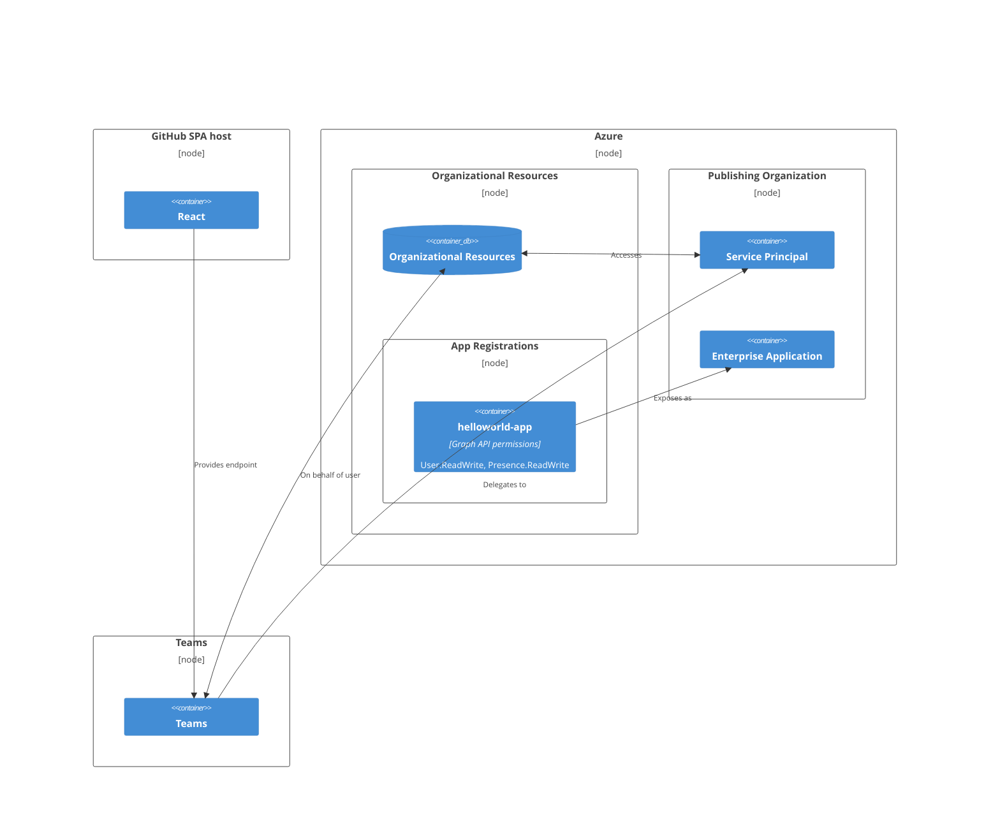

## Deployment Architecture 

```mermaid
C4Deployment
    title  
    
    Deployment_Node(github, "GitHub SPA host") {
        Container(React, "React", "", "")
    }

    Deployment_Node(azure, "Azure") {
        Deployment_Node(organizationalResources, "Organizational Resources") {
        ContainerDb(Organizational_Resources, "Organizational Resources", "")
        
        Deployment_Node(appRegistrations, "App Registrations") {
                Container(helloworld_app, "helloworld-app", "Graph API permissions", "User.ReadWrite, Presence.ReadWrite")
            }
        }

        Deployment_Node(publishingOrganization, "Publishing Organization") {
            Container(Service_Principal, "Service Principal", "", "")
            Container(Enterprise_Application, "Enterprise Application", "", "")        
        }
    }
        
    Deployment_Node(teams, "Teams") {
        Container(Teams, "Teams", "", "")
    }
    
    Rel(helloworld_app, Enterprise_Application, "Exposes as")
    BiRel(Service_Principal, Organizational_Resources, "Accesses")
    Rel(Teams, Service_Principal, "Delegates to")
    BiRel(Teams, Organizational_Resources, "On behalf of user")
    Rel(React, Teams, "Provides endpoint")

    UpdateRelStyle(Teams, Organizational_Resources, $offsetY="-15", $offsetX="-40")
```
