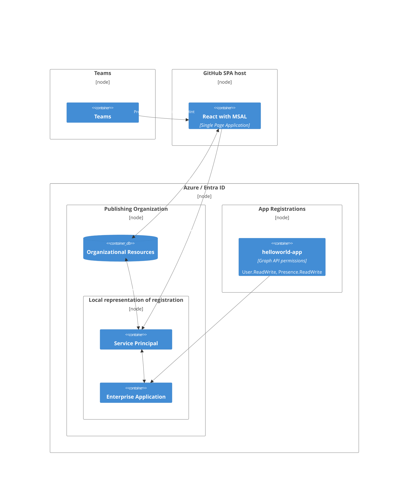
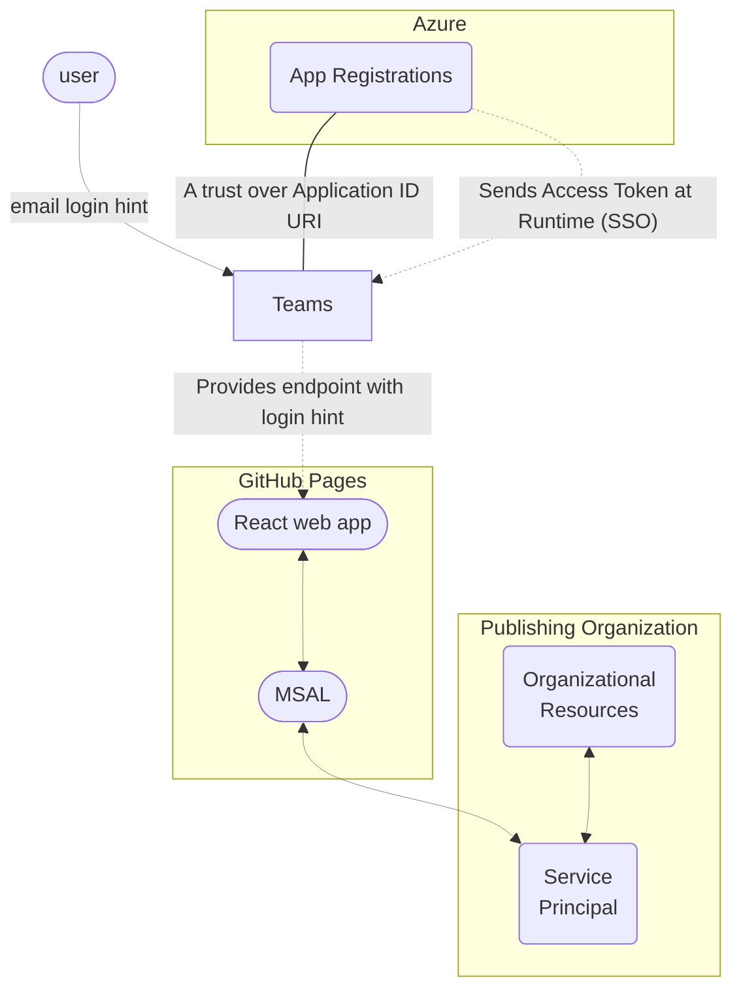
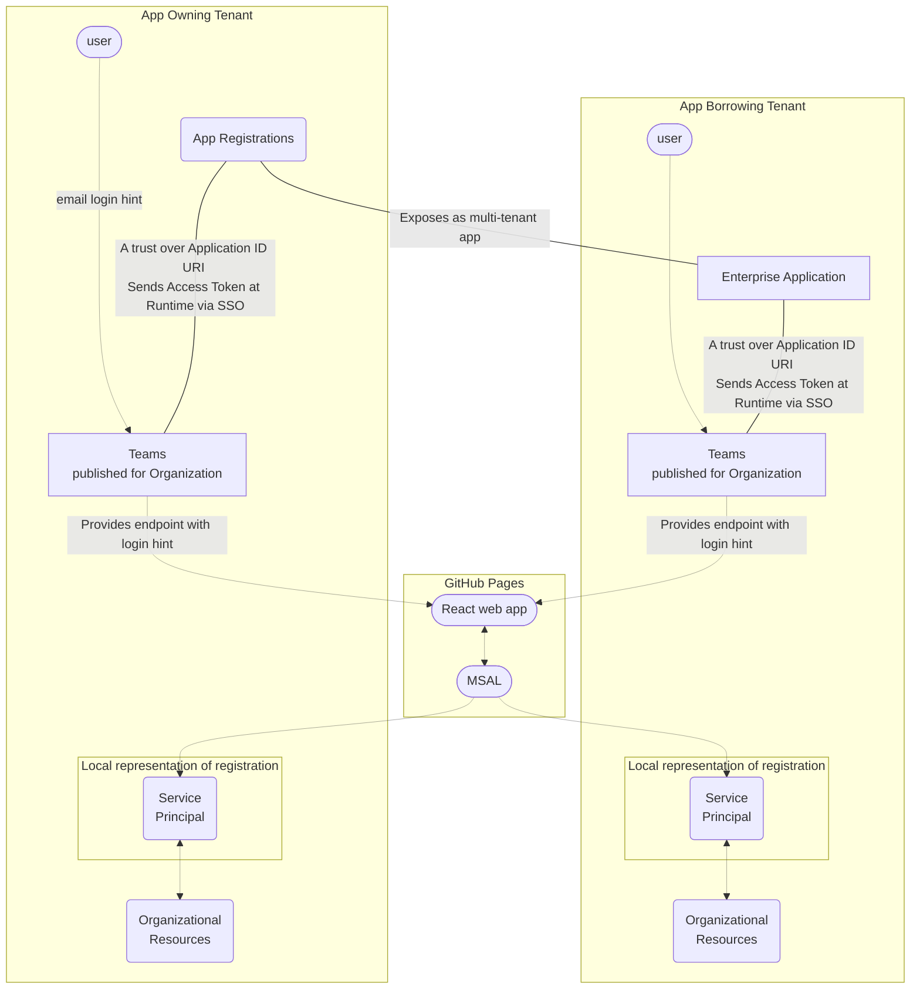

## Deployment Architecture 

## SSO auth flow 

## Publishing the application as Multi-tenant Application in other tenants  

  
on Teams with SSO 👀

  </img>

  
on web browser with login popup 👀

  </img>
  </img>

